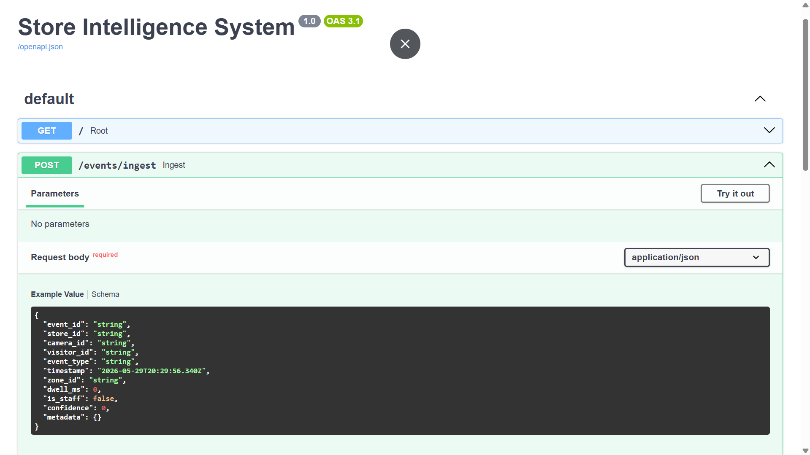
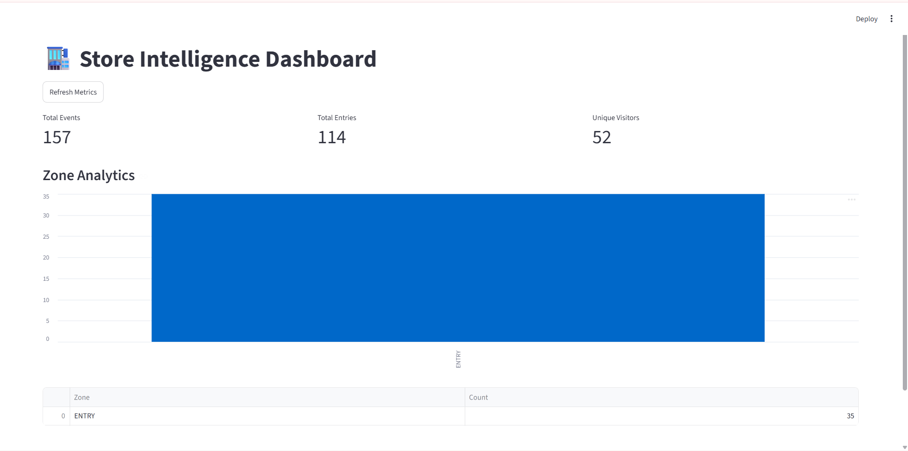

# Store Intelligence System

## Overview

AI-powered retail analytics platform built for the Purplle Tech Challenge 2026.

The system processes CCTV footage in real-time using computer vision, tracking, event streaming, analytics APIs, and dashboard visualization.

---
## Problem statement

“A retail chain has strong online analytics but very limited visibility inside physical stores. The goal of this project is to use CCTV footage to understand customer behavior inside stores — such as visitor count, dwell time, queue buildup, conversion rate, and customer movement across zones — and expose these insights through APIs and dashboards.”
## Features
# Screenshots

## Swagger API Documentation



---

## Store Intelligence Dashboard



---

## Detection & Tracking Pipeline


### Computer Vision Pipeline

* YOLOv8 person detection
* ByteTrack multi-object tracking
* Persistent visitor IDs
* Zone-based intelligence

### Event Streaming

* ENTRY events
* ZONE_ENTER events
* ZONE_EXIT events
* Dwell time analytics
* JSONL event stream

### Analytics Engine

* Visitor counting
* Zone analytics
* Funnel conversion analytics
* Dwell time metrics
* Anomaly detection

### Production APIs

* FastAPI backend
* Swagger documentation
* Health monitoring
* Metrics APIs
* Funnel APIs
* Anomaly APIs

### Dashboard

* Streamlit analytics dashboard
* Real-time metrics visualization
* Zone analytics charts

### Infrastructure

* Dockerized deployment
* Reproducible environment
* Production-style architecture

---

# System Architecture

CCTV Video
→ YOLOv8 Detection
→ ByteTrack Tracking
→ Event Engine
→ JSONL Event Stream
→ FastAPI Backend
→ Metrics Engine
→ Dashboard & APIs

---

# APIs

## Health API

GET /health

## Metrics API

GET /metrics

## Funnel API

GET /funnel

## Anomaly API

GET /anomalies

## Event Ingestion API

POST /events/ingest

---

# Run Locally

## Install Dependencies

```bash
pip install -r infra/requirements.txt
```

## Start Backend

```bash
uvicorn app.main:app --reload
```

## Start Dashboard

```bash
streamlit run dashboard/app.py
```

---

# Docker Deployment

```bash
cd infra
docker compose up --build
```

---

# Technologies Used

* Python
* FastAPI
* Streamlit
* YOLOv8
* ByteTrack
* OpenCV
* Docker

---

# Future Improvements

* Kafka event streaming
* Redis caching
* PostgreSQL persistence
* Re-identification embeddings
* Multi-camera fusion
* Queue prediction models
* Real-time WebSocket streaming

---

# Author

Built for Purplle Tech Challenge 2026
